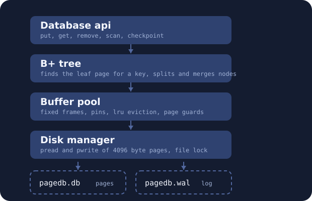

PageDB is an embedded key value store written in C++20. One database is one
file that is split into 4096 byte pages. It keeps keys in order in a B+ tree,
writes every change to a log first, and comes back after a crash with every
write it said yes to. There is no server and no other database library
underneath it, everything from the page reads upwards is in this repository.

It was written to learn how a storage engine works. It is not a product.

## Parts



## Build and test

    cmake -S . -B build -DCMAKE_BUILD_TYPE=Release
    cmake --build build
    ctest --test-dir build

`scripts/check.sh` builds the same tests again with the address, undefined
behaviour and thread sanitizers.

## Use

```cpp
#include <pagedb/database.hpp>

pagedb::DatabaseOptions options;
options.path = "example.db";
options.buffer_pool_pages = 1024;
options.durable = true;

pagedb::Result<std::unique_ptr<pagedb::Database>> opened =
    pagedb::Database::open(options);
std::unique_ptr<pagedb::Database> db = opened.take();

db->put("city/berlin", "3.6 million");

pagedb::Result<std::optional<std::string>> got = db->get("city/berlin");
if (got.ok() && got.value().has_value()) {
    // got.value().value() is "3.6 million"
}

pagedb::Result<std::vector<pagedb::KVPair>> rows = db->scan("city/", "city0");

db->close();
```

`put` replaces the value of a key that is already there. `get` of a missing
key is not an error, it gives back an empty optional. `remove` of a missing
key gives `NotFound`. `scan` gives back the rows from the first key up to but
not including the last one, in key order.

Keys are 1 to 64 bytes, values 0 to 256 bytes, both are compared and stored
as plain bytes. One process at a time may open a database file for writing.

## Numbers

Apple M3, 200000 records of 16 byte keys and 100 byte values, one thread:

| operation | with fsync | without fsync |
|---|---|---|
| sequential insert | 22451 /s | 49633 /s |
| random get | 708813 /s | 666171 /s |
| range scan of 100 rows | 64105 /s | 70289 /s |

The full setup, the cache and thread sweeps and the recovery time are in
`docs/benchmarks.md`.

## What works

Insert, lookup, replace, delete and ordered range scan, all kept in one file.
Pages are freed on delete and used again. A crash of the process after a
`put` or `remove` that returned `Ok` keeps that write, which is tested by
killing a child process with `SIGKILL`. Reads may run in parallel, writes run
one after the other. The tests also run under the address, undefined
behaviour and thread sanitizers.

Passing these tests does not mean the code has no bugs. What is missing or
weak is written down in `docs/limitations.md`.

## Documents

- `docs/architecture.md` what the four layers do and in which order the locks
  are taken
- `docs/on_disk_format.md` every byte in the file and in the log
- `docs/recovery_design.md` what a crash may and may not lose, and why
- `docs/benchmarks.md` measured numbers and how to repeat them
- `docs/limitations.md` what it can not do

The logo and the picture above are drawn by `tools/make_logo.py`.
